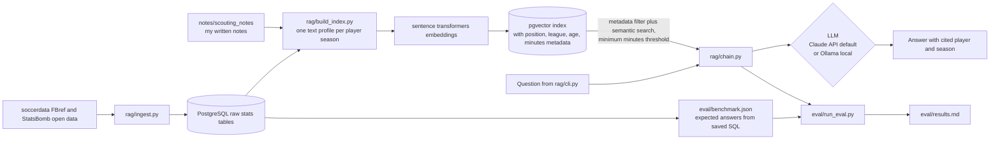

# player_undervaluation_model
A data-driven football model for identifying players whose performance and development profile may be undervalued relative to market value.

# Research question:
Using only pre transfer data, can a model identify players moving from nine European leagues outside the top five to top five league clubs who become regular starters within two seasons, and were such players undervalued by the market at the time of transfer?

## Scope
Phase 1: Belgium, Netherlands, Portugal, Turkey, Scotland, Denmark, Greece,
Russia, Ukraine to England, Spain, Italy, Germany, France. All positions.
Phase 2: add South America (needs historical data not in the current dataset).

## Data
Built on [transfermarkt-datasets](https://github.com/dcaribou/transfermarkt-datasets)
by dcaribou (CC0 1.0), sourced from Transfermarkt. Snapshot: 2026-07-06.
Raw data is not included in this repo; see docs/data_sources.md to download.

## RAG scouting assistant (planned, in progress)

> Status: **planned**. Folder structure, prompts, profile document format and benchmark schema are in the repo. No data has been pulled, nothing is indexed and the benchmark has not been run. Results below will be filled in from `eval/results.md` only after a real run.

### What it does
A question answering assistant over player profiles for recruitment questions such as
"which wingers outside the top five leagues match this profile?". Every answer cites the
exact player records (player and season) it used. If the retrieved records don't support
an answer, it replies "not enough data" instead of guessing.

It is a new component that feeds the undervaluation model: it makes the same pre transfer
player profiles searchable in plain language and gives a second view of the data used for scouting shortlists.

### Architecture

### Stack
Python, LangChain, PostgreSQL with pgvector, sentence transformers embeddings (free, runs locally),
Claude API by default with Ollama as a local option. Keys live in `.env` (gitignored); see `.env.example`.

### Layout

| Path | Purpose | Status |
|---|---|---|
| `rag/ingest.py` | Pull player season stats into Postgres raw tables | Planned (stub) |
| `rag/documents.py` | Turn a player season row into a text profile plus metadata | Working, tested |
| `rag/build_index.py` | Embed profiles and write them to pgvector | Planned (stub) |
| `rag/prompts.py` | System prompt: answer only from records, cite every claim, say "not enough data" | Written |
| `rag/chain.py` | Retrieval plus LLM chain | Planned (stub) |
| `rag/cli.py` | Ask a question from the terminal | Planned (stub) |
| `notes/scouting_notes/` | My own scouting notes, linked to a player by id | Placeholder |
| `eval/benchmark.json` | 20 questions, each with the SQL that produces its expected answer | Schema only, 0 of 20 written |
| `eval/run_eval.py` | Answer accuracy, citation accuracy, "not enough data" check | Planned (stub) |
| `eval/results.md` | Dated results from the latest run | Not run yet |

### Order of work

1. [x] README plan and architecture, repo scaffold
2. [ ] Data pull into Postgres tables (target 2,000+ player profiles)
3. [ ] Profile documents and pgvector index
4. [ ] Chain and CLI working end to end
5. [ ] Benchmark (20 questions, SQL backed ground truth), eval run, results recorded

### Evaluation plan
Every expected answer is produced by a SQL query saved next to its question, so ground truth is
reproducible and not hand written. Question types: single fact lookups, filtered rankings,
profile matching, comparisons, plus questions where the right answer is "not enough data".
Metrics: answer accuracy, citation accuracy (cited players are the correct ones), and the
"not enough data" rate on questions that should trigger it.

### Open questions before step 2
* **Stat availability.** FBref advanced stats (xG, xA, progressive carries) were removed in Jan 2026 (see `docs/data_sources.md`). Need to check live what soccerdata still returns per league, and whether StatsBomb open data covers any target league and season. Profile fields will follow what is actually available.
* **League list.** The ask names Eredivisie, Primeira Liga, Belgian Pro League, Championship and MLS. Phase 1 of the main model uses BE1, NL1, PO1, TR1, SC1, DK1, GR1, RU1, UKR1. Still deciding whether the RAG matches Phase 1 exactly.
* **Database.** The main pipeline currently uses DuckDB over Transfermarkt files. Postgres plus pgvector is new for this component.
* **Leakage.** Anything the RAG passes to the undervaluation model must use only seasons before the transfer date.

### Latest eval results

| Date | Profiles indexed | Answer accuracy | Citation accuracy | "Not enough data" correct |
|---|---|---|---|---|
| Not run yet | N/A | N/A | N/A | N/A |
